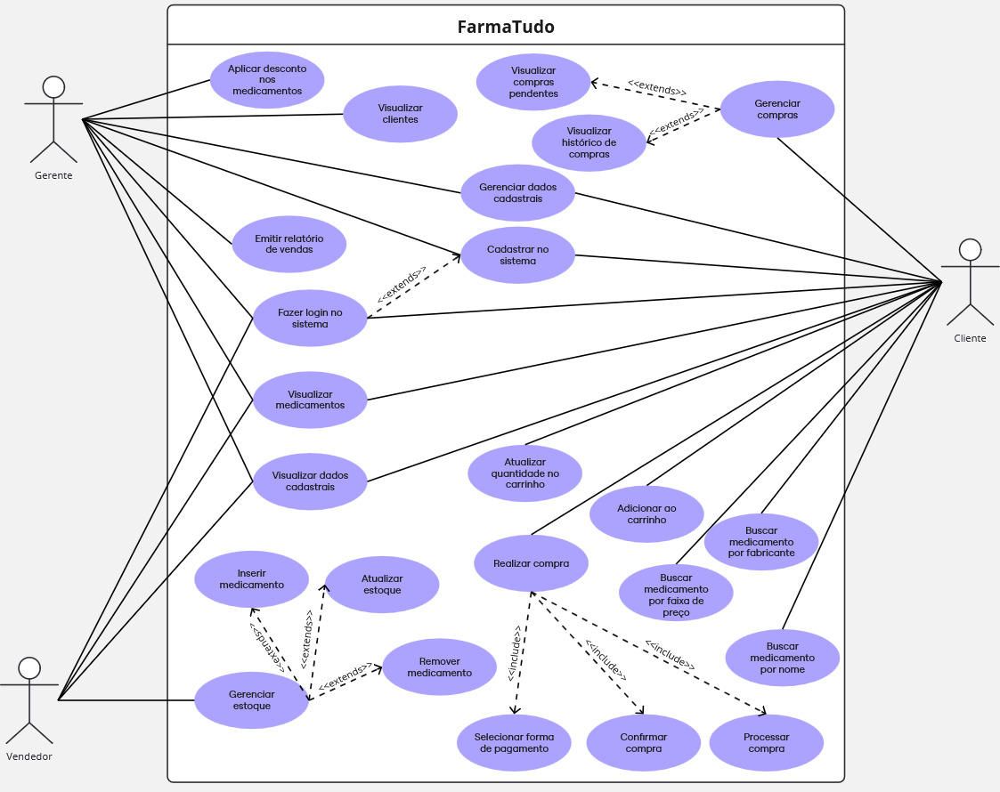
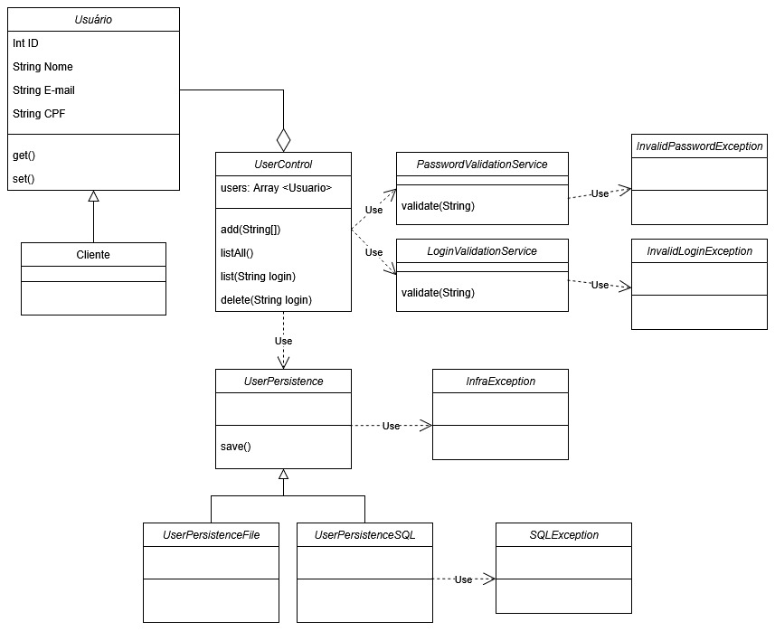

# sistema-farmacia

## Diagramas

### Diagrama de caso de uso



### Diagrama de Classe



### Estrutura das pastas

```txt
/docs           # arquivos de documentação
/src            # código fonte
  ./view   # interfaces com os atores
  ./business
    ./entidade    # modelos de dados e regras de negócio (uml)
    ./controle    # ligação entre fronteira e entidade
  ./infra
```
